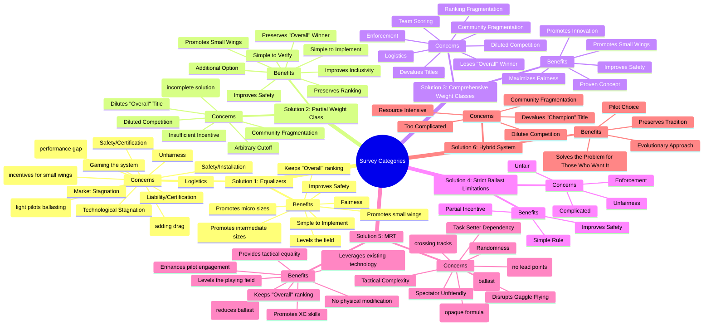

# Survey Categories

This document visualizes the categories of "benefits" and "concerns" associated with each proposed solution in the Ballast & Fairness survey.

## Categories per Solution (Mermaid Diagram)

## Proposed Higher-Level Categories

Based on the detailed points above, we can start grouping them into more generic themes. This can help in analyzing the overall sentiment and priorities of the community.

Here is a first draft of such higher-level categories:

*   **Safety**
    *   *Description*: Concerns or benefits related to pilot safety, equipment certification, and incident liability.
    *   *Examples*: `Improves Safety`, `Safety/Certification`, `Safety/Installation`, `Safety (light pilots ballasting)`, `Safety (incomplete solution)`, `Ineffective on Safety (ballast)`, `Safety (crossing tracks)`, `Improves Safety (reduces ballast)`.

*   **Fairness & Equality**
    *   *Description*: How a solution impacts the level playing field for pilots of different weights.
    *   *Examples*: `Levels the field`, `Maximizes Fairness`, `Unfairness`, `Unfairness (performance gap)`, `Unfairness (doesn't solve disparity)`, `Fairness (addresses performance gap)`, `Task Setter Dependency`, `Levels the playing field`, `Provides tactical equality`, `Randomness`.

*   **Competition Prestige & Tradition**
    *   *Description*: How a solution affects the value, structure, and tradition of competition titles and rankings.
    *   *Examples*: `Keeps "Overall" ranking`, `Dilutes "Overall" Title`, `Devalues Titles`, `Preserves Tradition`, `Changes Scoring (no lead points)`.

*   **Implementation & Logistics**
    *   *Description*: The practical aspects of introducing and managing a solution. This includes complexity, enforcement, and resource requirements.
    *   *Examples*: `Simple to Implement`, `Logistics`, `Enforcement`, `Resource Intensive`, `Complexity (opaque formula)`, `Leverages existing technology`.

*   **Market & Technical Innovation**
    *   *Description*: The effect of a solution on glider development, market incentives for manufacturers, and overall technological progress.
    *   *Examples*: `Promotes small wings`, `Market Stagnation`, `Technological Stagnation`, `Promotes Innovation`.

*   **Community & Pilot Experience**
    *   *Description*: The impact on the pilot community, social dynamics, and the overall experience of racing.
    *   *Examples*: `Community Fragmentation`, `Pilot Choice`, `Tactical Complexity`, `Disrupts Gaggle Flying`, `Spectator Unfriendly`, `Enhances pilot engagement`, `Promotes XC skills`.
